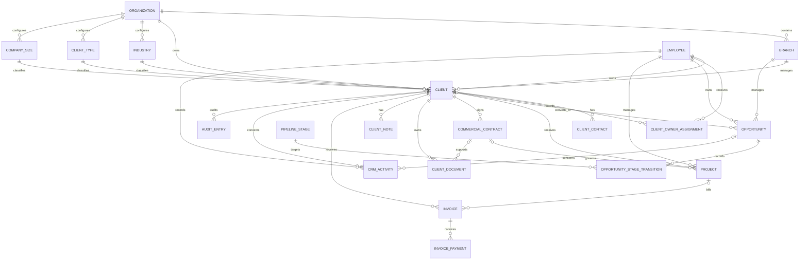

# Client / CRM domain model

This document models the client screens before API, service, or UI implementation. It describes the business concepts represented by the screenshots and the boundaries between them. It is intentionally storage- and framework-neutral; the later database schema should preserve these boundaries.

## Scope from the screenshots

The fifteen supplied images show six related surface groups:

1. A Client overview dashboard with counts, revenue, payment, industry, branch, and conversion summaries.
2. An All clients directory with search, filters, ownership, branch, revenue, outstanding balance, project count, and last activity.
3. An Add client form with client name, industry, client type, account owner, branch, phone, and email.
4. A Leads & pipeline board with opportunities grouped by pipeline stage.
5. A Client profile with company identity, health, priority, a named primary contact, current projects, and tabs for Contacts, Projects, Commercial Contracts, Documents, Activities, Notes, Timeline, and Audit Log.
6. An Invoice directory with issue/due dates, amount, and billing state.

Invoices appear as a related billing view. They are not a client status, and payment status is not a sales stage.

## Ubiquitous language

| Term                | Meaning                                                                  | Boundary                                                                                                              |
| ------------------- | ------------------------------------------------------------------------ | --------------------------------------------------------------------------------------------------------------------- |
| Organization        | The current workspace/tenant that owns CRM data.                         | Existing system concept; not the external Client.                                                                     |
| Branch              | An operational location inside the Organization.                         | Each Client is assigned to exactly one Branch for ownership and reporting.                                            |
| Client              | An external company or customer organization served by the Organization. | Stable commercial account; it can have many Projects, Opportunities, Invoices, and Activities.                        |
| Account Owner       | The internal Employee responsible for the Client relationship.           | Ownership is an Employee relationship, not an authenticated User relationship.                                        |
| Client Contact      | A named person associated with a Client.                                 | One may be primary; Client business phone/email remain separate company contact channels.                             |
| Industry            | An editable sector classification.                                       | Used by directory filters and revenue grouping; should not be a hard-coded application enum.                          |
| Client Type         | An editable classification such as Enterprise.                           | Separate from Client Status and Pipeline Stage.                                                                       |
| Company Size        | An editable classification of organizational scale.                      | Separate from Client Type even if both currently display Enterprise.                                                  |
| Opportunity         | A commercial pursuit for a prospect or existing Client.                  | `clientId` may be empty until conversion; the opportunity remains the same record after conversion.                   |
| Pipeline Stage      | The current editable sales step of an Opportunity.                       | Lead → Qualified → Proposal sent → Negotiation → Waiting payment are initial catalog entries.                         |
| Project             | Work delivered for a Client.                                             | Its delivery status is independent from sales and invoice status.                                                     |
| Commercial Contract | A commercial agreement with a Client.                                    | Distinct from the workforce Employment Contract.                                                                      |
| Client Document     | A versioned business file belonging to a Client.                         | May additionally concern one Commercial Contract, Opportunity, Project, or Invoice; separate from Employee Documents. |
| Client Note         | An internal authored note about a Client.                                | Separate from the event-oriented CRM Activity history.                                                                |
| Invoice             | A payment request issued to a Client.                                    | Has an invoice lifecycle; its balance is affected by Invoice Payments.                                                |
| Invoice Payment     | Money received and allocated to an Invoice.                              | Enables collected, outstanding, and overdue calculations.                                                             |
| CRM Activity        | A deliberately recorded interaction involving a Client or Opportunity.   | Source for Last activity; system-generated business events belong to the Client Timeline projection.                  |
| Client Health       | A derived assessment of relationship health.                             | Separate from manually assigned Client Priority.                                                                      |
| Audit Entry         | Immutable history of changes to Client records.                          | Source for the Audit Log, not the business Timeline.                                                                  |

## Aggregates and relationships

### Aggregate roots

- **Client** is the primary CRM aggregate. It owns the company identity, primary business phone/email, Contact membership, current branch, account owner, classifications, priority, and relationship status.
- **Opportunity** is a separate aggregate because a prospect can exist before a Client and because several opportunities may exist for one Client.
- **Project** is a separate aggregate because delivery can continue after an opportunity is won and can have its own lifecycle.
- **Commercial Contract** is a separate aggregate because its term, renewal, and status must remain independent from Projects and workforce Employment Contracts.
- **Invoice** is a separate aggregate because financial records need independent issuance, payment, and audit rules.
- **Client Document** is a versioned Client-owned record that may additionally relate to a Commercial Contract, Opportunity, Project, or Invoice.
- **CRM Activity** is append-oriented history. It should not be replaced by overwriting `lastActivityAt` as the only source of truth.
- **Client Timeline** and **Client Health** are read models. The timeline combines source events; health combines relationship, activity, delivery, and billing signals.

## Conceptual schema

The following is the first relational blueprint. It is not Drizzle code or a migration.

### `clients`

| Field                                  | Meaning                        | Rule                                                                                                    |
| -------------------------------------- | ------------------------------ | ------------------------------------------------------------------------------------------------------- |
| `id`                                   | Stable Client identity         | Generated identifier.                                                                                   |
| `clientCode`                           | Permanent human-facing ID      | Generated and unique within the Organization, for example CLI-2026-000002.                              |
| `organizationId`                       | Owning workspace               | Required; every Client belongs to one Organization.                                                     |
| `branchId`                             | Managing Branch                | Required; one Client belongs to exactly one Branch.                                                     |
| `ownerEmployeeId`                      | Account Owner                  | Required; references an internal Employee.                                                              |
| `legalName`                            | Registered company name        | Required.                                                                                               |
| `tradingName`                          | Public/trading name            | Optional; directory display name falls back to Legal Name.                                              |
| `industryId`                           | Industry classification        | Required; references an editable active catalog entry.                                                  |
| `clientTypeId`                         | Client Type classification     | Required; references an editable active catalog entry.                                                  |
| `companySizeId`                        | Company Size classification    | Optional during creation; separate from Client Type.                                                    |
| `phone`                                | Primary business phone         | Optional.                                                                                               |
| `email`                                | Primary business email         | Optional.                                                                                               |
| `tin`                                  | Taxpayer identification number | Optional; unique within the Organization when present.                                                  |
| `vatNumber`                            | VAT registration number        | Optional.                                                                                               |
| `registrationNumber`                   | Company registration number    | Optional.                                                                                               |
| `businessLicenseNumber`                | Business licence number        | Optional.                                                                                               |
| `website`                              | Company website                | Optional.                                                                                               |
| `foundedYear`, `foundedCalendar`       | Company founding year          | Optional pair; preserves a year-only value such as 2009 E.C. without inventing a day.                   |
| `relationshipStartedOn`                | “Client since” date            | Required; defaults to the local business date at creation and is editable independently of `createdAt`. |
| `priority`                             | Manual Client Priority         | Optional during creation; independent from Client Health.                                               |
| `status`                               | Client relationship state      | Initially `active` or `archived`; not a pipeline/project/invoice label.                                 |
| `createdAt`, `updatedAt`, `archivedAt` | Lifecycle timestamps           | Archiving preserves financial and project history.                                                      |

### `industries`, `client_types`, `company_sizes`, and `pipeline_stages`

Each is a workspace-owned editable catalog. Referenced entries are deactivated instead of deleted so historical records retain their meaning.

- Industries, Client Types, and Company Sizes contain `id`, `organizationId`, `name`, `status`, and timestamps.
- Pipeline Stages contain `id`, `organizationId`, `name`, `position`, `outcome`, `status`, and timestamps. `position` controls board order; `outcome` distinguishes open, won, and lost stages even when administrators rename the display label.

The screenshot values (Banking, Enterprise, Lead, Qualified, and so on) are initial catalog data, not values embedded in UI logic. Client Type and Company Size remain distinct even when both catalogs contain an Enterprise label.

### `client_contacts`

| Field                                 | Meaning                                                                           |
| ------------------------------------- | --------------------------------------------------------------------------------- |
| `id`, `organizationId`, `clientId`    | Contact identity and ownership                                                    |
| `firstName`, `middleName`, `lastName` | Structured contact name; display name is derived                                  |
| `role`                                | Optional business role such as Accounts payable; “Primary” comes from `isPrimary` |
| `phone`                               | Direct phone number                                                               |
| `email`                               | Direct email address                                                              |
| `telegramHandle`                      | Optional Telegram username shown in the contact card                              |
| `isPrimary`                           | Marks the one primary named contact for the Client                                |
| `status`                              | Active or archived contact relationship                                           |
| `createdAt`, `updatedAt`              | Lifecycle timestamps                                                              |

A Client may have many Contacts but at most one active primary Contact. Client-level phone/email remain the company's general business channels. An active Contact must provide at least one reachable channel: phone, email, or Telegram.

### Client creation and profile enrichment

The Add client modal intentionally creates the minimum valid Client:

- “Company / client name” initializes `legalName`; `tradingName` remains empty until profile enrichment.
- Industry, Client Type, Account Owner, Branch, primary business phone, and primary business email map directly to Client fields.
- `clientCode` is generated by an Organization-scoped numbering policy and is never entered by the user.
- `relationshipStartedOn` defaults to the Organization's current local business date and remains editable.
- Company Size, priority, tax identifiers, registration/licence data, website, founding year, Contacts, and related records are added or edited from the Client profile.

This avoids hidden hard-coded placeholder values while allowing the exact create form shown in the screenshots.

### `client_owner_assignments`

`id`, `organizationId`, `clientId`, `ownerEmployeeId`, `assignedByUserId`, `effectiveFrom`, `effectiveTo`, and `createdAt` preserve Account Owner history. Exactly one assignment is open at a time. `Client.ownerEmployeeId` is the current-owner projection/cache and is changed transactionally with a new assignment; the dated assignment supplies the Timeline event.

### `opportunities`

| Field                                | Meaning                                         |
| ------------------------------------ | ----------------------------------------------- |
| `id`                                 | Stable commercial pursuit identity              |
| `organizationId`, `branchId`         | Workspace and reporting scope                   |
| `clientId`                           | Nullable until a prospect is converted          |
| `name`                               | Prospect/client opportunity name                |
| `industryId`                         | Industry classification                         |
| `ownerEmployeeId`                    | Responsible sales/account Employee              |
| `pipelineStageId`                    | Editable Pipeline Stage catalog entry           |
| `estimatedValue` and `currency`      | Expected commercial value; not realized revenue |
| `priority`                           | Low/medium/high urgency shown on cards          |
| `lastActivityAt`                     | Projection/cache of the latest CRM Activity     |
| `convertedAt`                        | Prospect-to-Client conversion time              |
| `createdAt`, `updatedAt`, `closedAt` | Lifecycle timestamps                            |

The initial screenshot stages are `lead`, `qualified`, `proposal_sent`, `negotiation`, and `waiting_payment`. Terminal outcomes such as `won` and `lost` are needed for conversion reporting and should be represented explicitly rather than inferred from a Client label.

### `opportunity_stage_transitions`

`id`, `organizationId`, `opportunityId`, optional `fromPipelineStageId`, `toPipelineStageId`, `changedByUserId`, `occurredAt`, and optional `note` preserve the sales history. `Opportunity.pipelineStageId` is the current-stage projection/cache. Proposal-sent Timeline items and conversion reporting use transitions and stage outcomes rather than guessing from the latest display label.

### `projects`

| Field                              | Meaning                        | Rule                                                                                 |
| ---------------------------------- | ------------------------------ | ------------------------------------------------------------------------------------ |
| `id`, `organizationId`, `clientId` | Project identity and ownership | Every Project belongs to one Client.                                                 |
| `branchId`                         | Reporting Branch               | Defaults from the Client but is stored for the Project's delivery/reporting context. |
| `commercialContractId`             | Governing agreement            | Optional; one Commercial Contract may govern several Projects.                       |
| `name`                             | Project name                   | Required.                                                                            |
| `managerEmployeeId`                | Internal Project manager       | Required; references an Employee.                                                    |
| `status`                           | Delivery lifecycle             | Initially `planning`, `in_progress`, `completed`, or `cancelled`.                    |
| `progressPercent`                  | Delivery progress              | Required integer from 0 through 100; independent from the status label.              |
| `budgetAmount`, `currency`         | Approved Project budget        | Required for the profile's budget display; not recognized revenue.                   |
| `startsOn`, `dueOn`, `completedOn` | Delivery dates                 | `completedOn` is set only when delivery completes.                                   |
| `createdAt`, `updatedAt`           | Lifecycle timestamps           | Record history is preserved.                                                         |

The profile's `Active project` label is derived from at least one Project whose status is `in_progress`. A completed Project has `progressPercent = 100` and a `completedOn` date.

### `commercial_contracts`

| Field                              | Meaning                                    | Rule                                                                  |
| ---------------------------------- | ------------------------------------------ | --------------------------------------------------------------------- |
| `id`, `organizationId`, `clientId` | Commercial Contract identity and ownership | Every Commercial Contract belongs to one Client.                      |
| `opportunityId`                    | Originating commercial pursuit             | Optional trace back to the Opportunity that produced the agreement.   |
| `contractCode`                     | Permanent human-facing ID                  | Generated and unique in the Organization, for example `CTR-2026-041`. |
| `serviceName`                      | Agreed service                             | Required, for example Managed service.                                |
| `billingCadence`                   | Agreement cadence                          | Optional; initial values include annual.                              |
| `startsOn`, `endsOn`               | Contract term                              | Required and ordered; end must be after start.                        |
| `renewalMode`                      | Renewal behavior                           | `automatic`, `manual`, or `none`.                                     |
| `status`                           | Agreement lifecycle                        | `draft`, `active`, `expired`, `terminated`, or `cancelled`.           |
| `signedOn`                         | Execution date                             | Required before an agreement becomes active.                          |
| `amount`, `currency`               | Optional commercial value                  | Does not become revenue until invoiced or collected.                  |
| `createdAt`, `updatedAt`           | Lifecycle timestamps                       | Preserve the agreement's record history.                              |

Commercial Contract is deliberately qualified: it is not the workforce Employment Contract. Contract signing is a Client Timeline event; the signed file is a related Client Document rather than a URL field on the contract.

### `invoices`

| Field                               | Meaning                               | Rule                                                                 |
| ----------------------------------- | ------------------------------------- | -------------------------------------------------------------------- |
| `id`, `organizationId`, `clientId`  | Invoice identity and Client ownership | Required.                                                            |
| `projectId`, `commercialContractId` | Billing context                       | Optional links to delivered work and its agreement.                  |
| `branchId`                          | Reporting Branch                      | Required snapshot for branch financial reporting.                    |
| `invoiceNumber`                     | Permanent human-facing ID             | Unique in the Organization.                                          |
| `issuedOn`, `dueOn`                 | Billing dates                         | `issuedOn` is empty while draft; due date cannot precede issue date. |
| `currency`, `totalAmount`           | Amount requested                      | Required; amount must be positive.                                   |
| `lifecycleStatus`                   | Authored invoice lifecycle            | `draft`, `issued`, or `void`; payment presentation is derived.       |
| `createdAt`, `updatedAt`            | Record timestamps                     | Financial history is preserved and audited.                          |

The screenshot's Draft/Sent/Paid/Overdue labels should not all be stored as an uncontrolled status:

- `draft` means the invoice is not issued.
- `sent` means it is issued and has an unpaid balance before the due date.
- `paid` means the outstanding balance is zero.
- `overdue` means the due date has passed while an outstanding balance remains.

Paid and overdue are derived from Invoice Payments, invoice total, and due date. A partial payment remains outstanding and can become overdue.

### `invoice_payments`

`id`, `invoiceId`, `amount`, `currency`, `paidOn`, `method`, `reference`, `recordedByEmployeeId`, and timestamps. Payment rows are append-only financial facts; correcting a payment should create an auditable reversal/adjustment rather than silently rewriting history.

### `client_documents`

| Field                                                             | Meaning                                | Rule                                                                              |
| ----------------------------------------------------------------- | -------------------------------------- | --------------------------------------------------------------------------------- |
| `id`, `organizationId`, `clientId`                                | Document identity and Client ownership | Required for every uploaded Client file.                                          |
| `commercialContractId`, `opportunityId`, `projectId`, `invoiceId` | Optional business context              | At most one is populated for a version; the file still belongs to the Client.     |
| `logicalDocumentId`                                               | Version-family identity                | Groups versions of the same business document.                                    |
| `kind`                                                            | Business classification                | Initial values: contract, proposal, registration, NDA, and invoice.               |
| `version`                                                         | Version number                         | Positive and unique within a logical document family.                             |
| `fileName`, `contentType`, `contentLength`                        | File metadata                          | Required; `contentLength` supplies the size displayed in the UI.                  |
| `storageKey`                                                      | Private object identity                | Store the object key, never a permanent public URL.                               |
| `accessLevel`                                                     | Access policy                          | Initially `standard` or `restricted`; the lock icon represents restricted access. |
| `uploadedByEmployeeId`, `uploadedAt`                              | Upload attribution                     | Required and immutable.                                                           |

Each uploaded version is immutable. Replacing a document creates a higher version in the same logical family. Storage authorization and short-lived download URLs belong to the later service/API design.

### `client_notes`

| Field                                  | Meaning                     | Rule                                                                      |
| -------------------------------------- | --------------------------- | ------------------------------------------------------------------------- |
| `id`, `organizationId`, `clientId`     | Note identity and ownership | Required.                                                                 |
| `authorEmployeeId`                     | Internal author             | Required and preserved even if the Employee later becomes inactive.       |
| `body`                                 | Authored note text          | Required and non-empty.                                                   |
| `isPinned`                             | Profile prominence          | Independent from creation time; multiple notes may be pinned.             |
| `createdAt`, `updatedAt`, `archivedAt` | Note lifecycle              | Editing changes `updatedAt`; removal archives rather than erases history. |

### `crm_activities`

| Field                       | Meaning                       | Rule                                                               |
| --------------------------- | ----------------------------- | ------------------------------------------------------------------ |
| `id`, `organizationId`      | Activity identity and scope   | Required.                                                          |
| `clientId`, `opportunityId` | Subject                       | At least one is required; profile activities always have a Client. |
| `clientContactId`           | External participant          | Optional named Client Contact.                                     |
| `actorEmployeeId`           | Internal recorder/participant | Required.                                                          |
| `activityType`              | Interaction kind              | Initial values: call, meeting, email, and site visit.              |
| `summary`, `details`        | Activity content              | Summary is required; details are optional.                         |
| `occurredAt`                | Business occurrence time      | Drives activity ordering and Last activity.                        |
| `createdAt`, `updatedAt`    | Record timestamps             | Kept separately from when the interaction occurred.                |

`lastActivityAt` in directory and card views is a projection from this history. A CRM Activity is intentionally recorded by a user; it is not the same as a system-generated Timeline event or an Audit Entry.

### Client health read model

Client Health is calculated rather than manually stored as the Client's status. The read model contains `clientId`, `band`, `score`, `reasons`, and `calculatedAt`. Its inputs may include recent CRM Activity, Project delivery state, outstanding/overdue Invoice balances, and relationship recency. The exact formula is deferred, but the model must support the screenshot's valid combination of `Healthy` health and `Critical` manual priority.

### Client timeline read model

The Timeline tab is a chronological union of important business events; it is not an independently edited table. Initial event kinds shown by the screenshots are:

- Client created
- Proposal sent
- Commercial Contract signed
- Account Owner assigned
- Invoice generated
- Invoice Payment received
- Meeting logged
- Payment overdue

Every item exposes a stable source reference, event kind, title, detail, and occurrence time. Its source remains the authoritative Client, Opportunity, Commercial Contract, Invoice, Invoice Payment, CRM Activity, or assignment history record.

The screenshot's audit wording “updated status to active project” is presentation copy for an underlying Project transition that changed the Client Directory Status projection. `active_project` is never written into `Client.status`.

### `audit_entries`

| Field                              | Meaning                        | Rule                                                                                      |
| ---------------------------------- | ------------------------------ | ----------------------------------------------------------------------------------------- |
| `id`, `organizationId`, `clientId` | Audit identity and scope       | Required.                                                                                 |
| `actorType`, `actorId`             | Who performed the change       | Actor is an authenticated user or the system; display may resolve a linked Employee name. |
| `action`                           | Stable machine-readable action | Required, for example `client.status_changed` or `invoice.payment_recorded`.              |
| `entityType`, `entityId`           | Record changed                 | Required.                                                                                 |
| `changeSummary`                    | Safe before/after metadata     | Optional; must exclude secrets and private document content.                              |
| `occurredAt`                       | Exact change time              | Required.                                                                                 |

Audit Entries are append-only and immutable. The Audit Log answers who changed data and when; Timeline answers what commercially meaningful events happened to the Client.

## Reporting read models

Dashboard and directory values are query projections, not writable Client fields.

### Client overview dashboard

The overview exposes:

- Total Clients and Clients created in the current reporting month.
- Invoiced Revenue and Collected Revenue for the selected period, each with an explicit label and prior-period comparison. The screenshot's generic “Revenue this month” must become one named measure or show both; the model never exposes an ambiguous revenue fact.
- Total outstanding amount, including overdue balances, plus overdue invoice count.
- Average deal size, initially the average estimated value of converted Opportunities; this is a sales measure, not revenue.
- Active Project count and the number of distinct Branches delivering them.
- Recurring Client count and percentage of the Client base.
- Lead conversion: all-time converted Opportunities divided by all Opportunities, matching the agreed simple first version.
- Six reporting months of both revenue measures. Calendar labels such as Tahsas and Tir are presentation of canonical reporting periods in the Organization's calendar/time zone.
- A disjoint payment distribution: collected, open but not overdue, and overdue. The dashboard's total outstanding equals the latter two categories together.
- Revenue grouped by Industry, Client, and Branch using the selected named revenue measure.

### Client directory row

The directory projection exposes Client identity/code, Industry, derived Client Directory Status, Account Owner, Branch, both named revenue measures, outstanding balance, Project count, and latest CRM Activity time. Search covers names, code, and primary business email; filters use Client Directory Status, Industry, and Account Owner. A one-column UI may select one named revenue measure, but the API model must not return an unlabeled `revenue` value.

## Screenshot traceability

Every supplied image contributes to the model. The repeated Add client image confirms the same create workflow from both the directory and pipeline context rather than defining a second entity.

| Image | Screen                    | Domain information captured                                                                                                                                                                                                                                    |
| ----- | ------------------------- | -------------------------------------------------------------------------------------------------------------------------------------------------------------------------------------------------------------------------------------------------------------- |
| 1     | Clients / CRM overview    | Client counts, invoiced/collected revenue reporting, outstanding and overdue balances, average deal size, active Projects, recurring Clients, lead conversion, payment distribution, and revenue groupings by month, Industry, top Client, and Branch.         |
| 2     | All clients directory     | Search; filters by Client Directory Status, Industry, and Account Owner; column selection; Client code; derived directory status; Branch; revenue; outstanding balance; Project count; Last activity; pagination; add/export actions.                          |
| 3     | Add client modal          | Minimal creation command: legal/company name, Industry, Client Type, Account Owner, Branch, primary business phone, primary business email, and generated permanent Client code.                                                                               |
| 4     | Leads & pipeline          | Opportunity cards grouped by ordered Pipeline Stage, owner, Industry, expected value, priority, Last activity, stage counts, and new-lead creation.                                                                                                            |
| 5     | Add client from pipeline  | Confirms Add client uses the same Client command and fields regardless of entry point.                                                                                                                                                                         |
| 6     | Invoices                  | Invoice number, Client, issue and due dates, amount, currency, and Draft/Sent/Paid/Overdue presentation states.                                                                                                                                                |
| 7     | Client profile / Overview | Permanent Client code; legal/trading identity; Industry; Account Owner; Branch; relationship start; derived directory status and Health; Client Priority and Type; tax/registration/licence/website/founding data; primary Contact; current Project summaries. |
| 8     | Contacts tab              | Multiple Client Contacts, exactly one designated primary, business role, direct phone/email, and optional Telegram handle.                                                                                                                                     |
| 9     | Projects tab              | Project name, delivery status, progress percentage, manager Employee, budget/currency, and deadline.                                                                                                                                                           |
| 10    | Commercial Contracts tab  | Contract code, service, billing cadence, term dates, renewal mode, and agreement status.                                                                                                                                                                       |
| 11    | Documents tab             | Upload workflow; document kind; filename; logical versions; upload date; size; and restricted-access indicator.                                                                                                                                                |
| 12    | Notes tab                 | Employee author, authored date, body, and pinned state.                                                                                                                                                                                                        |
| 13    | Activities tab            | Call, meeting, email, and site-visit interactions with Employee actor, summary/details, and occurrence date.                                                                                                                                                   |
| 14    | Timeline tab              | Read-only business-event projection spanning billing, Activities, owner assignment, contracts, proposals, and Client creation.                                                                                                                                 |
| 15    | Audit log tab             | Immutable user/system change history with action description and exact timestamp.                                                                                                                                                                              |

## Field-to-domain mapping

| Screenshot value                                          | Domain source                                                                                  |
| --------------------------------------------------------- | ---------------------------------------------------------------------------------------------- |
| Client name, ID                                           | `Client.tradingName ?? Client.legalName` and generated permanent `Client.clientCode`.          |
| Legal/trading name, TIN, VAT, registration, licence       | Client company identity and regulatory fields.                                                 |
| Website, company size, founded                            | Client profile fields, editable Company Size catalog, and founding year/calendar pair.         |
| Client since                                              | Explicit `Client.relationshipStartedOn`, not `createdAt`.                                      |
| Industry                                                  | Client → Industry catalog                                                                      |
| Account owner                                             | Client → Employee                                                                              |
| Branch                                                    | Client → Branch                                                                                |
| Primary contact / Add contact                             | Client → Client Contacts; at most one active Contact is primary.                               |
| Healthy / Critical                                        | Derived Client Health / manually assigned Client Priority; these are independent.              |
| Revenue                                                   | Two named measures: Invoiced Revenue from issued invoices and Collected Revenue from payments. |
| Outstanding                                               | Invoice total minus allocated Invoice Payments                                                 |
| Projects                                                  | Count of Client's Projects                                                                     |
| Last activity                                             | Latest CRM Activity                                                                            |
| Active project                                            | Derived from at least one `in_progress` Project                                                |
| Project progress, manager, budget, deadline               | Project delivery fields and Employee relationship                                              |
| Recurring                                                 | Client has at least two Projects currently `in_progress` or `completed`                        |
| Proposal sent / Negotiation / Waiting payment             | Current Opportunity Pipeline Stage, not Client or Invoice status                               |
| Completed                                                 | Most recent Project is completed and the Client has no active Project                          |
| Viewing as Owner/Finance/Sales manager/Sales rep/Employee | Access/presentation perspective, not a Client field                                            |
| Revenue by month/industry/branch                          | Separate Invoiced Revenue and Collected Revenue read models grouped by Client dimensions       |
| Payment status donut                                      | Dashboard read model from Invoice balances                                                     |
| Contract term, renewal, and status                        | Commercial Contract; never Employment Contract                                                 |
| Document kind, version, date, size, lock                  | Versioned Client Document metadata and access level                                            |
| Notes                                                     | Client Note                                                                                    |
| Calls, meetings, emails, site visits                      | CRM Activity                                                                                   |
| Timeline                                                  | Derived cross-aggregate business-event projection                                              |
| Audit log                                                 | Immutable Audit Entries                                                                        |

## Invariants to preserve

1. Every Client belongs to exactly one Organization and exactly one Branch and has one Account Owner.
2. A Client may have many Contacts, Opportunities, Projects, Commercial Contracts, Documents, Notes, Invoices, and CRM Activities.
3. An Opportunity may exist without a Client; conversion attaches it to a Client without changing its identity or history.
4. A Client cannot be hard-deleted while Projects, Invoices, Payments, or Activities exist; archive it instead.
5. Revenue is never calculated from an Opportunity's estimated value.
6. Outstanding and overdue amounts are calculated from invoice totals, payments, and due dates.
7. A payment cannot be allocated to an Invoice belonging to another Organization.
8. A CRM Activity must have an actor and a Client or Opportunity target.
9. A Client directory status must be a projection assembled from separate relationship, opportunity, project, and billing facts.
10. A Client is Recurring when at least two Projects currently have `in_progress` or `completed` status; planning and cancelled Projects do not count.
11. Completed is shown only when the most recent Project is completed and no Project remains in progress. Active project takes precedence when in-progress and completed Projects coexist.
12. Invoiced Revenue and Collected Revenue are separate measures and must not be combined under an ambiguous stored `revenue` field.
13. A Client with Contacts has at most one active primary Contact; Client-level phone and email remain separate company channels.
14. Client Health is derived and must not overwrite manually assigned Client Priority.
15. Project progress is between 0 and 100; completed Projects have 100 percent progress and a completion date.
16. A Commercial Contract is never stored in or interpreted as a workforce Employment Contract.
17. Client Document versions, Audit Entries, Invoice Payments, and Timeline source events are immutable historical facts.
18. A Document version belongs to one Client and may reference at most one immediate business context: Commercial Contract, Opportunity, Project, or Invoice.
19. Timeline items are derived from their source records and are not authored directly.
20. Every Audit Entry identifies an authenticated actor or the system and records an exact occurrence time.
21. Changing an Account Owner closes the previous assignment and opens one new assignment in the same transaction.
22. Moving an Opportunity records a Stage Transition; renaming a Pipeline Stage does not erase the historical transition.
23. An Audit summary may describe a derived display result, but mutations always target the authoritative record that produced it.
24. Creating a Client does not invent Company Size, Priority, regulatory identifiers, or Contacts that were not supplied.
25. A founding year retains its source calendar; a year-only value is not coerced into an arbitrary date.

## Resolved modeling decisions

1. Revenue is represented by two separate metrics: Invoiced Revenue and Collected Revenue.
2. One Client belongs to exactly one Branch.
3. Phone and email are optional primary company channels; a Client may also have multiple named Contacts and at most one active primary Contact.
4. Industries, Client Types, Company Sizes, and Pipeline Stages are editable workspace catalogs.
5. A Recurring Client has at least two Projects currently in progress or completed.
6. Lead conversion is initially the all-time percentage of Opportunities that have been converted to Clients; reporting-period refinement is deferred.
7. Completed in the directory means the most recent Project is completed and no Project remains in progress.
8. Client Type and Company Size are separate classifications even if both display Enterprise.
9. Client Health is derived; Client Priority is manually assigned.
10. Timeline and Audit Log are separate read concerns: commercial events versus technical change accountability.
11. Commercial Contracts and Employment Contracts are separate domain concepts and persistence models.

## Client directory status precedence

When several facts apply to one Client, the directory shows one headline in this order:

1. `Active project` when any Project is `in_progress`. This takes precedence even if the Client also has an outstanding Invoice, matching the directory screenshot.
2. The most advanced open Opportunity Pipeline Stage, such as Waiting payment, Negotiation, or Proposal sent.
3. `Completed` when the most recent Project is completed and no Project remains in progress.
4. `Recurring` as the fallback segment when the Client qualifies as recurring and no higher-priority operational state applies.
5. The base Client Status, such as Active or Archived.

This precedence is a read-model rule. It does not overwrite the underlying Client, Opportunity, Project, or Invoice states.

## Out of scope for this phase

No routes, services, API contracts, UI components, dashboard query implementation, seed data, migrations, or payment gateway integration are defined here. Those should be built only after the language and decisions above are confirmed.
